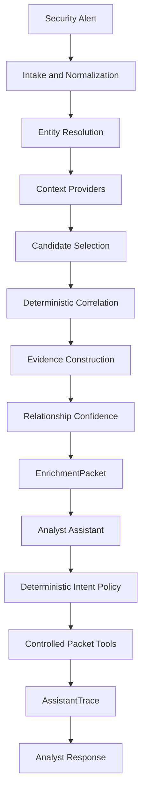

# SOC Context Enrichment Prototype

A deterministic Python reference implementation for enriching security alerts with operational context **without treating retrieval similarity as relationship proof**.

The project explores a common detection engineering problem: an alert may be technically correct while important operational context lives somewhere else. A ticket, change record, identity event, asset record, or historical case can be useful, but only if the system can establish *why* it is related and preserve what it could not verify.

No external model is required. The bounded analyst assistant sits downstream of the deterministic enrichment result and cannot change correlation, evidence, confidence, ambiguity, or disposition.

## Core ideas

> **Retrieved does not mean related.**

> **Evidence absent does not mean evidence unavailable.**

> **Relationship confidence does not mean alert disposition.**

> **The assistant consumes validated evidence; it does not decide what is true.**

## Architecture



The trust boundary is deliberate. Providers retrieve raw records. Normalization owns canonical representation. Entity resolution is deterministic and ambiguity preserving. Candidate selection decides what is eligible for evaluation. Correlation decides whether a relationship is supported, partially supported, contradicted, or not supported. Evidence preserves provenance. Confidence describes trust in the relationship assessment, not maliciousness or severity.

The assistant only consumes the accepted `EnrichmentPacket`.

## Quick start

Requires Python 3.11 or newer.

### Windows PowerShell

```powershell
python -m venv .venv
.\.venv\Scripts\Activate.ps1
python -m pip install --upgrade pip setuptools
python -m pip install -e ".[test]"
python -m context_enrichment demo
```

### macOS / Linux

```bash
python3 -m venv .venv
source .venv/bin/activate
python -m pip install --upgrade pip setuptools
python -m pip install -e ".[test]"
python -m context_enrichment demo
```

## Three demonstration paths

### 1. Supported operational context

```bash
python -m context_enrichment demo
```

The primary scenario demonstrates a privileged password change alert with supporting change and identity context. Entity normalization, relationship evidence, confidence, provenance, assistant planning, tool calls, and the analyst response are visible in one terminal flow.

Expected high level result:

```text
Operational context exists
        ↓
Entities resolve
        ↓
Records correlate
        ↓
Evidence supports the relationship
        ↓
HIGH relationship confidence
        ↓
Analyst receives contextual evidence
```

### 2. False association defense

```bash
python -m context_enrichment demo --scenario false-join
```

A plausible looking record is retrieved, but the user identity does not match.

Expected high level result:

```text
Plausible candidate
        ↓
Explicit identity mismatch
        ↓
Relationship rejected
        ↓
No qualifying evidence fabricated
        ↓
NO_RELIABLE_CONTEXT_FOUND
```

This is the central safety property: retrieval is not treated as proof.

### 3. Provider degradation

```bash
python -m context_enrichment demo --scenario provider-failure
```

One context provider is unavailable while another still supplies useful evidence.

Expected high level result:

```text
One source unavailable
        ↓
Other evidence remains valid
        ↓
Relationship survives
        ↓
Confidence degrades
        ↓
PARTIAL_ENRICHMENT
```

The system preserves the distinction between **successfully finding no evidence** and **being unable to check an evidence source**.

## Bounded analyst assistant

The assistant workflow is intentionally finite:

```text
AssistantRequest
→ deterministic intent policy
→ finite AssistantAction plan
→ EnrichmentService or accepted packet tools
→ AssistantTrace
→ AssistantResponse
```

The assistant cannot:

- query providers independently of the accepted enrichment path
- redefine entity resolution
- change candidate selection
- alter correlation
- fabricate evidence
- change confidence
- suppress ambiguity or provider failure
- close an alert or perform response actions

A model adapter exists only as an optional presentation boundary. The default release runs with no model, no model SDK, no API key, and no network dependency at runtime.

## Validation

Run the replay corpus:

```bash
python -m context_enrichment validate --scenarios fixtures/scenarios
```

Run the demonstration layer validation:

```bash
python -m context_enrichment demo-validate
```

Run the test suite:

```bash
python -m pytest -q
```

The validation corpus covers exact relationships, aliases, host normalization, similar usernames, unrelated hosts, stale context, approved and cancelled changes, contradictions, missing and malformed timestamps, competing tickets, historical context, no-context cases, provider failure, malformed provider records, duplicates, identity contradictions, and deterministic replay.

See [docs/VALIDATION.md](docs/VALIDATION.md).

## Repository map

```text
src/context_enrichment/
  application/           orchestration and execution state
  assistant/             bounded analyst assistant
  candidate_selection/   evaluation eligibility
  confidence/            semantic relationship trust
  correlation/           deterministic relationship features
  domain/                canonical contracts
  entity_resolution/     deterministic entity resolution
  evidence/              provenance bearing evidence
  normalization/         canonical schema conversion
  output/                deterministic rendering
  providers/             provider contract and synthetic implementations
  validation/            replay and demonstration validation

fixtures/                 synthetic providers and V01 to V20 scenarios
tests/                    unit, adversarial, failure and end to end tests
docs/                     architecture, validation and integration guidance
```

## Extending providers

The five included providers are synthetic roles, not vendor assumptions:

- ticket
- change
- identity
- asset
- historical case

A real integration should implement the provider contract and return raw records plus structured diagnostics. It should **not** move normalization, correlation, evidence, or confidence into the connector.

See [docs/PROVIDER_INTEGRATION.md](docs/PROVIDER_INTEGRATION.md).

## Production boundary

This is a reference implementation, not a production SOC platform. It does not implement production authentication, secrets management, privacy controls, audit infrastructure, deployment resilience, vendor APIs, external model governance, or response automation.

Those requirements are documented rather than simulated.

See [docs/PRODUCTIONIZATION.md](docs/PRODUCTIONIZATION.md).

## License

Apache License 2.0. See [LICENSE](LICENSE).
